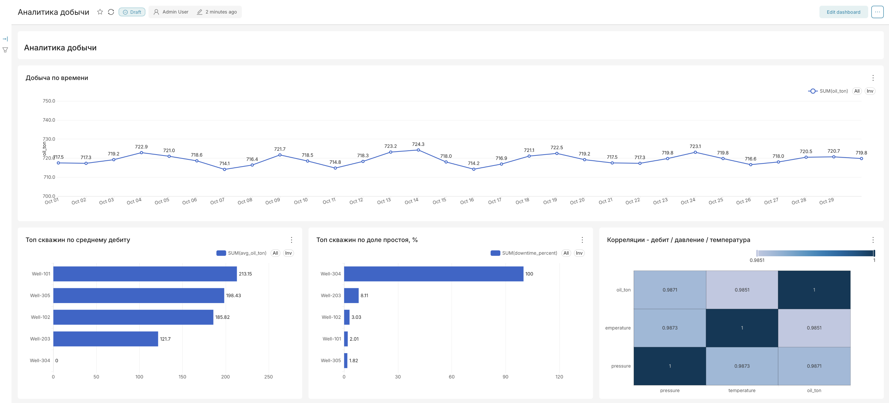
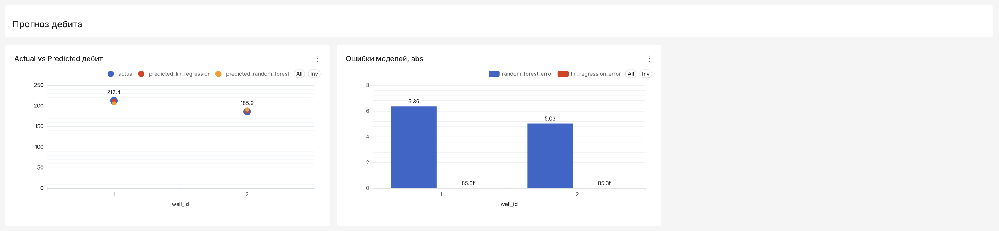
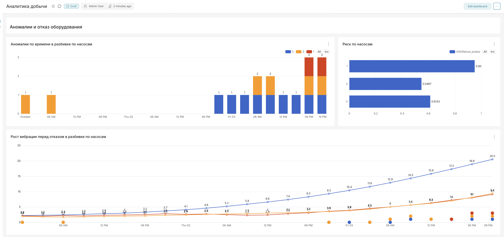
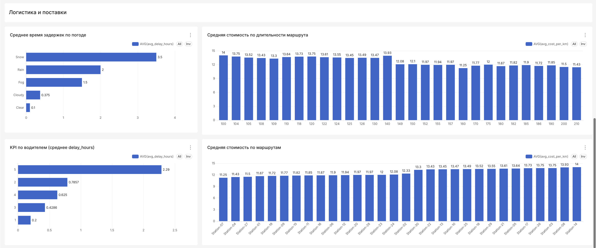

# Аналитическая инфраструктура

Этот проект поднимает локальную аналитическую инфраструктуру в Docker. В составе окружения используются PostgreSQL, MinIO, Jupyter и Apache Superset.

Окружение предназначено для работы с данными, хранения файлов, запуска ноутбуков и построения аналитических дашбордов.

## Состав сервисов

В проект входят следующие сервисы:

- **PostgreSQL** — основная реляционная база данных для хранения аналитических данных.
- **MinIO** — S3-совместимое объектное хранилище для файлов и датасетов.
- **Jupyter Notebook** — среда для анализа данных и запуска Python-кода.
- **Apache Superset** — BI-инструмент для построения графиков, витрин и дашбордов.

## Запуск проекта

Для запуска всех сервисов необходимо выполнить команду из корневой директории проекта:

```bash
docker compose up -d
```

После выполнения команды Docker запустит все контейнеры в фоновом режиме.

Проверить, что контейнеры успешно запущены, можно командой:

```bash
docker compose ps
```

Если сервисы запустились корректно, в списке контейнеров должен отображаться статус `running` или `healthy`.

## Остановка проекта

Для остановки всех сервисов используется команда:

```bash
docker compose down
```

Если нужно остановить сервисы и дополнительно удалить созданные volumes, можно выполнить:

```bash
docker compose down -v
```

> Важно: команда с флагом `-v` удаляет данные, которые хранились в Docker volumes.

## Адреса и доступы к сервисам

### PostgreSQL

PostgreSQL используется как основная база данных проекта.

#### Параметры подключения к PostgreSQL

```text
host:     postgres
port:     5432
database: analytics
username: user
password: pass
```

### MinIO

MinIO используется как локальное S3-совместимое хранилище. В него можно загружать файлы, датасеты и результаты обработки данных.

#### Доступ к MinIO Console

```text
UI:       http://localhost:9001
username: user
password: pass
```

#### API endpoint

```text
API:      http://localhost:9000
```

Через веб-интерфейс MinIO можно создавать buckets, загружать файлы и проверять содержимое объектного хранилища.

### Jupyter Notebook

Jupyter используется для интерактивной работы с данными, запуска Python-кода и проверки гипотез.

#### Доступ к Jupyter

```text
URL:      http://localhost:8888
token:    analytics
```

В Jupyter можно подключаться к PostgreSQL, читать данные из MinIO, выполнять обработку данных в pandas и сохранять результаты обратно в базу или объектное хранилище.

### Apache Superset

Superset используется для визуализации данных, построения графиков и создания дашбордов.

#### Доступ к Superset

```text
URL:      http://localhost:8088
username: admin
password: admin
```

После входа в Superset можно подключить базу PostgreSQL как источник данных и создавать датасеты, чарты и дашборды.

## Подключение PostgreSQL в Superset

Для подключения PostgreSQL в Superset можно использовать параметры:

```text
host:     postgres
port:     5432
database: analytics
username: user
password: pass
```

## Рекомендуемый порядок работы

1. Запустить все сервисы командой:

```bash
docker compose up -d
```

2. Проверить статус контейнеров:

```bash
docker compose ps
```

3. Открыть MinIO и при необходимости создать bucket для хранения данных.

4. Открыть Jupyter и выполнить подготовку или загрузку данных.

5. Открыть Superset, подключить PostgreSQL и построить визуализации.

## Быстрая проверка доступности сервисов

После запуска проекта можно проверить сервисы по адресам:

```text
MinIO:    http://localhost:9001
Jupyter:  http://localhost:8888
Superset: http://localhost:8088
```

## Полезные команды

Посмотреть запущенные контейнеры:

```bash
docker compose ps
```

Посмотреть логи всех сервисов:

```bash
docker compose logs
```

Посмотреть логи конкретного сервиса:

```bash
docker compose logs superset
```

Перезапустить конкретный сервис:

```bash
docker compose restart superset
```

Остановить все сервисы:

```bash
docker compose down
```

Остановить сервисы и удалить volumes:

```bash
docker compose down -v
```

# Скриншоты дашбордов Superset

В папке `superset/screenshots` находятся скриншоты дашбордов, подготовленных для каждого задания.

## Задание 1



## Задание 2



## Задание 3



## Задание 4

